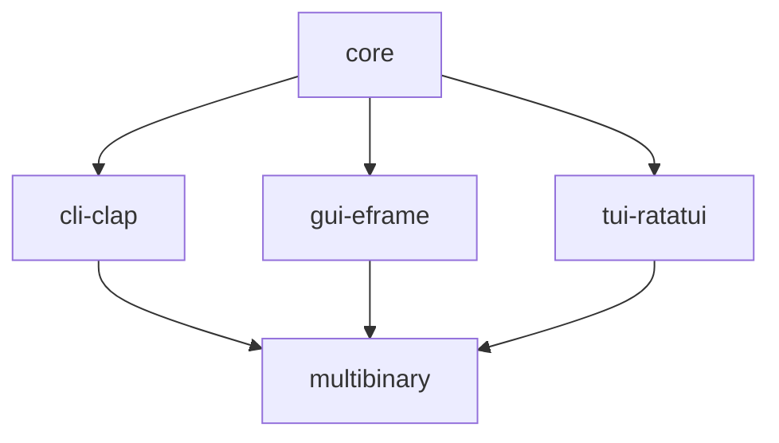

`ac-qu-ai-nt` is a project I'm working on, using artificial intelligence to break down the user's query, acquire knowledge, and transfer insights to the user('s mind).

This is a placeholder while I take small steps to build out the project.

# Installation

## Automatically Updatable
You won't find it very useful yet, because it doesn't really do much of anything, but you can install the multibinary with [Binstall](https://github.com/cargo-bins/cargo-binstall). This means you don't need to have the same development environment (which will require the Vulkan SDK and CUDA Toolkit in the future) in order to use the program, because you'll just download a precompiled executable.

```sh
cargo-binstall -y ac-qu-ai-nt
```

Install [`cargo-update`](https://github.com/nabijaczleweli/cargo-update) and periodically run
```sh
cargo install-update --all
```
in order to keep this program up to date.

I'm not sure if you need a Rust compiler installed for either or if they can work standalone.

## Just the Executable
Head to [the Releases page](https://github.com/babichjacob/ac-qu-ai-nt/releases) and download the asset corresponding to your computer architecture and operating system.

Decompress the archive and place the executable contained within it somewhere useful to you (e.g. in a directory in [your `PATH` variable](https://superuser.com/a/284351)).

# Usage
If it's your preference, you should be able to double click the executable in the folder to be able to run it (defaulting to launching a graphical interface (once I actually make one lol)).

You could also type
```sh
ac-qu-ai-nt
```
on the command line to run it. This is also a way to launch a GUI (once there actually is one) for the application.

## Command Line Interface
It's going to be a goal of this project for there to be feature parity between the GUI, CLI, and TUI.

If you want to use its command line interface, start with

```sh
ac-qu-ai-nt cli
```
to see what capabilities are available.

(This is an alias for `ac-qu-ai-nt cli-clap` to allow the possibility of experimenting with different implementations of the same type of interface.)

# Contributing

This is a summary of the crates I expect to be in this project and how they are used:



## Versioning

This project aims to adhere to [semantic versioning](https://semver.org/) using [Conventional Commits](https://www.conventionalcommits.org/en/v1.0.0/#summary), conducted by [Release-plz](https://release-plz.ieni.dev/).

To be more specific about what a breaking change _could_ entail:

- a previously successful compilation now failing
- the program (wrongly) exiting, panicking, reporting an error, etc, where it didn't previously
- changing the expected result of an existing integration test (not sure if unit tests would count)

All the crates in this project have a [minimum supported Rust version (MSRV)](https://rust-lang.github.io/rfcs/2495-min-rust-version.html) of 1.76, the release succeeding [the one that stabilized `async fn` in traits](https://blog.rust-lang.org/2023/12/28/Rust-1.75.0.html) (which the `core` crate of this project is expected to make use of). I [intend to test this in CI (GitHub Actions) in the future](https://github.com/babichjacob/ac-qu-ai-nt/issues/5) to identify if it ever gets raised by changes but I have not set this up yet. Raising the MSRV will be considered a breaking change --- my justification is that it [seems more appropriate for an application like this](https://github.com/matklad/once_cell/issues/201#issuecomment-1257213601). This may be reconsidered if [Cargo's MSRV-aware resolver](https://rust-lang.github.io/rfcs/3537-msrv-resolver.html) is stabilized.

## License

All contents of this repository are licensed under either the
* [MIT license](LICENSE-MIT), or
* [Apache 2.0 license](LICENSE-APACHE), or
* [Unlicense](LICENSE-UNLICENSE)

at your option.
