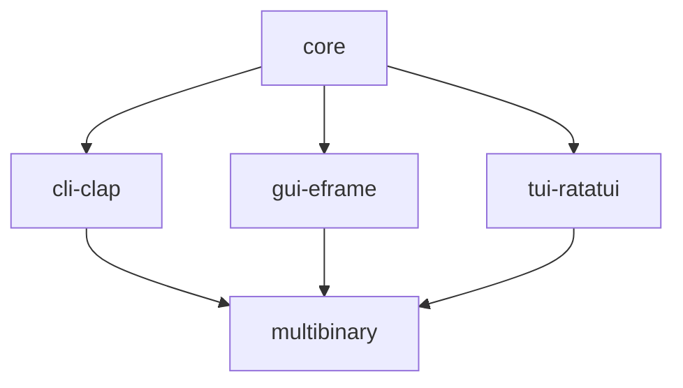

# ac-qu-ai-nt

`ac-qu-ai-nt` is a project I'm working on, using artificial intelligence to break down the user's query, acquire knowledge, and transfer insights to the user('s mind).

This is a placeholder while I take small steps to build out the project.

# Contributing

This is a summary of the crates I expect to be in this project and how they are used:

## Versioning

This project aims to adhere to [semantic versioning](https://semver.org/) using [Conventional Commits](https://www.conventionalcommits.org/en/v1.0.0/#summary), conducted by [Release-plz](https://release-plz.ieni.dev/).

To be more specific about what a breaking change _could_ entail:

- a previously successful compilation now failing
- the program (wrongly) exiting, panicking, reporting an error, etc, where it didn't previously
- changing the expected result of an existing integration test (not sure if unit tests would count)

All the crates in this project have a [minimum supported Rust version (MSRV)](https://rust-lang.github.io/rfcs/2495-min-rust-version.html) of 1.76, the release succeeding [the one that stabilized `async fn` in traits](https://blog.rust-lang.org/2023/12/28/Rust-1.75.0.html) (which the `core` crate of this project is expected to make use of). I [intend to test this in CI (GitHub Actions) in the future](https://github.com/babichjacob/ac-qu-ai-nt/issues/5) to identify if it ever gets raised by changes but I have not set this up yet. Raising the MSRV will be considered a breaking change --- my justification is that it [seems more appropriate for an application like this](https://github.com/matklad/once_cell/issues/201#issuecomment-1257213601). This may be reconsidered if [Cargo's MSRV-aware resolver](https://rust-lang.github.io/rfcs/3537-msrv-resolver.html) is stabilized.

## License

All contents of this repository are licensed under either the
* [MIT license](LICENSE-MIT), or
* [Apache 2.0 license](LICENSE-APACHE), or
* [Unlicense](LICENSE-UNLICENSE)

at your option.
