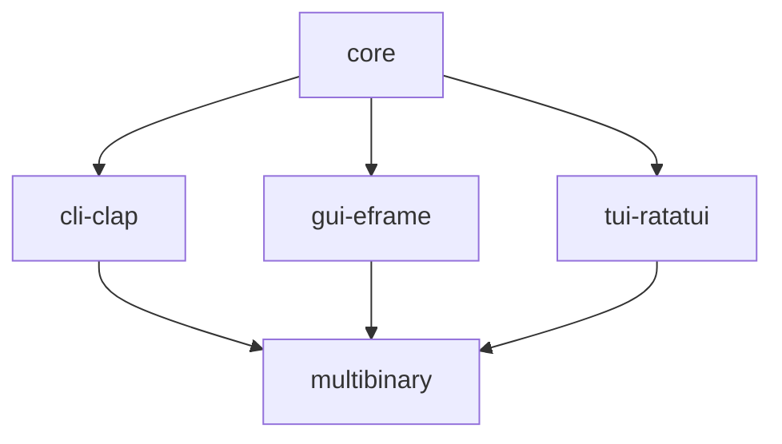

# ac-qu-ai-nt

`ac-qu-ai-nt` is a project I'm working on, using artificial intelligence to break down the user's query, acquire knowledge, and transfer insights to the user('s mind).

This is a placeholder while I take small steps to build out the project.

# Contributing

This is a summary of the crates I expect to be in this project and how they are used:

